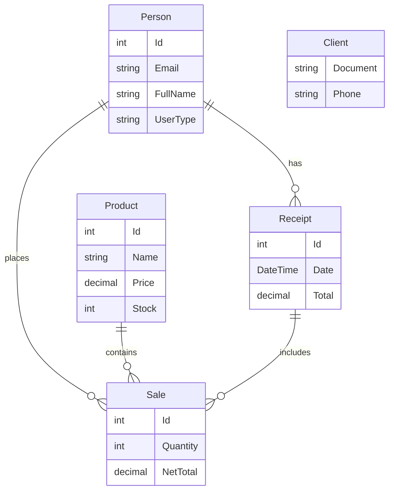

# Firmeza API

## Descripción
API RESTful para el sistema de gestión "Firmeza", desarrollada en .NET 8.
Incluye gestión de productos, clientes, ventas, autenticación JWT y notificaciones por correo.

## Tecnologías
- .NET 8
- Entity Framework Core (PostgreSQL)
- Identity & JWT
- AutoMapper
- Swagger (Swashbuckle)
- xUnit (Pruebas Unitarias)
- Docker Support

## Diagramas Técnicos

### Modelo Entidad-Relación (Simplificado)


## Instalación y Ejecución

### Requisitos
- .NET SDK 8.0
- PostgreSQL
- Docker (Opcional)

### Ejecución Local
1. Configurar la cadena de conexión en `appsettings.json`.
2. Ejecutar migraciones (si es necesario):
   ```bash
   dotnet ef database update
   ```
3. Ejecutar la API:
   ```bash
   dotnet run --project FirmezaAPI
   ```
4. Acceder a Swagger: `http://localhost:5273/swagger`

### Docker
1. Construir la imagen:
   ```bash
   docker build -t firmeza-api .
   ```
2. Ejecutar el contenedor:
   ```bash
   docker run -p 8080:8080 -e ConnectionStrings__PostgreSQLConnection="Host=..." firmeza-api
   ```

## Endpoints Principales
- **Auth**: Registro y Login (JWT).
- **Products**: CRUD de productos (Búsqueda y filtrado).
- **Clients**: Gestión de clientes.
- **Sales**: Gestión de ventas y recibos.
